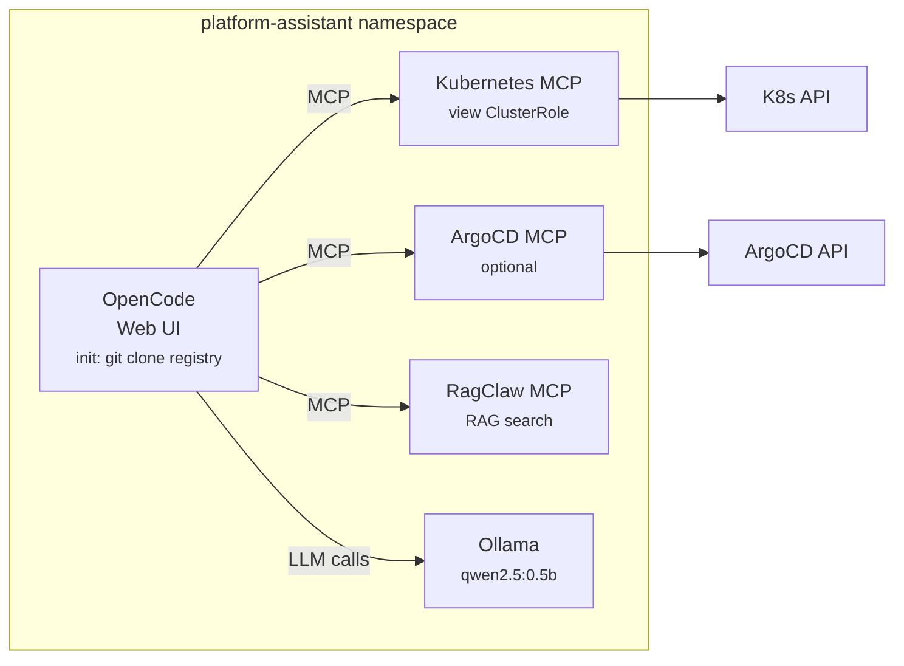

# Platform Assistant

AI-powered platform assistant for Kubernetes — ships [OpenCode](https://opencode.ai) with MCP servers for cluster ops, ArgoCD, and RAG search.

## Overview

Platform Assistant deploys a pre-configured OpenCode web UI connected to:

| Component | Description | Default |
|-----------|-------------|---------|
| **OpenCode** | AI coding assistant web UI | Always on |
| **Kubernetes MCP** | Read-only cluster introspection via MCP | Always on |
| **Ollama** | Local LLM inference (qwen3.5:0.8b) | Enabled |
| **RagClaw MCP** | RAG search over indexed documents/code | Enabled |
| **ArgoCD MCP** | GitOps operations via MCP | Disabled |

Skills and agents are bundled in the [`opencode/`](../../opencode) directory of this repository and loaded on startup, providing platform engineering workflows like `kubernetes-ops`, `argocd-ops`, and `kb-search`.

## Prerequisites

- Kubernetes 1.26+
- Helm 3.12+
- (Optional) GPU nodes for Ollama acceleration

## Quick Start

### Zero-config install

```bash
helm install platform-assistant \
  oci://ghcr.io/emdzej/charts/platform-assistant \
  -n platform-assistant --create-namespace
```

This gives you OpenCode + Kubernetes MCP (read-only) + RagClaw + Ollama with `qwen3.5:0.8b`. No API keys needed.

> **Note:** First startup takes a few minutes while Ollama downloads the model.

### Access the UI

```bash
kubectl port-forward svc/platform-assistant-opencode 4096:4096 -n platform-assistant
# Open http://localhost:4096
```

### With external providers

```bash
helm install platform-assistant \
  oci://ghcr.io/emdzej/charts/platform-assistant \
  -n platform-assistant --create-namespace \
  --set opencode.providers.anthropic.enabled=true \
  --set opencode.providers.anthropic.apiKey=sk-ant-...
```

### With ArgoCD

```bash
helm install platform-assistant \
  oci://ghcr.io/emdzej/charts/platform-assistant \
  -n platform-assistant --create-namespace \
  --set argocd.enabled=true \
  --set argocd.apiToken=<your-argocd-token> \
  --set argocd.baseURL=http://argocd-server.argocd.svc.cluster.local
```

### Without Ollama (external provider only)

```bash
helm install platform-assistant \
  oci://ghcr.io/emdzej/charts/platform-assistant \
  -n platform-assistant --create-namespace \
  --set ollama.enabled=false \
  --set opencode.providers.default=anthropic \
  --set opencode.providers.anthropic.enabled=true \
  --set opencode.providers.anthropic.existingSecret=my-anthropic-secret
```

## Architecture



## Values Reference

### OpenCode

| Key | Description | Default |
|-----|-------------|---------|
| `opencode.image.tag` | OpenCode image tag | `latest` |
| `opencode.replicaCount` | Number of replicas | `1` |
| `opencode.web.port` | Web UI port | `4096` |
| `opencode.service.type` | Service type | `ClusterIP` |
| `opencode.resources` | CPU/memory requests and limits | `{}` |

### Providers

| Key | Description | Default |
|-----|-------------|---------|
| `opencode.providers.default` | Default LLM provider | `ollama` |
| `opencode.providers.ollama.enabled` | Use in-cluster Ollama | `true` |
| `opencode.providers.ollama.model` | Ollama model name | `qwen3.5:0.8b` |
| `opencode.providers.ollama.baseURL` | Override Ollama URL | auto-discovered |
| `opencode.providers.anthropic.enabled` | Enable Anthropic | `false` |
| `opencode.providers.anthropic.apiKey` | API key (plaintext) | `""` |
| `opencode.providers.anthropic.existingSecret` | Use existing K8s Secret | `""` |
| `opencode.providers.anthropic.existingSecretKey` | Key in the Secret | `ANTHROPIC_API_KEY` |
| `opencode.providers.githubCopilot.enabled` | Enable GitHub Copilot | `false` |
| `opencode.providers.githubCopilot.apiKey` | API key | `""` |
| `opencode.providers.githubCopilot.existingSecret` | Use existing Secret | `""` |
| `opencode.providers.custom.enabled` | Enable custom provider | `false` |
| `opencode.providers.custom.name` | Display name | `""` |
| `opencode.providers.custom.baseURL` | Provider base URL | `""` |

### Skills & Agents Registry

| Key | Description | Default |
|-----|-------------|---------|
| `opencode.registry.enabled` | Fetch skills/agents on startup | `true` |
| `opencode.registry.repository` | Git repository URL | `https://github.com/emdzej/platform-assistant.git` |
| `opencode.registry.ref` | Branch, tag, or commit | `main` |
| `opencode.registry.path` | Path within repo to copy | `opencode` |
| `opencode.registry.image.repository` | Init container image | `alpine/git` |

### Persistence

| Key | Description | Default |
|-----|-------------|---------|
| `opencode.workspace.existingClaim` | Use existing PVC for workspace | `""` |
| `opencode.workspace.storageClass` | Storage class (empty = default) | `""` |
| `opencode.workspace.size` | Workspace volume size | `5Gi` |
| `opencode.sessionData.existingClaim` | Use existing PVC for sessions | `""` |
| `opencode.sessionData.storageClass` | Storage class | `""` |
| `opencode.sessionData.size` | Session data volume size | `2Gi` |

### Kubernetes MCP Server

| Key | Description | Default |
|-----|-------------|---------|
| `kubernetes-mcp.config.read_only` | Read-only mode | `true` |
| `kubernetes-mcp.config.stateless` | Stateless mode (recommended) | `true` |
| `kubernetes-mcp.rbac.extraClusterRoleBindings` | RBAC bindings | `[{view ClusterRole}]` |
| `kubernetes-mcp.service.port` | Service port | `8080` |

### ArgoCD MCP Server

| Key | Description | Default |
|-----|-------------|---------|
| `argocd.enabled` | Deploy ArgoCD MCP server | `false` |
| `argocd.baseURL` | ArgoCD server URL | `http://argocd-server.argocd.svc.cluster.local` |
| `argocd.readOnly` | Read-only mode | `true` |
| `argocd.apiToken` | API token (plaintext) | `""` |
| `argocd.existingSecret` | Use existing Secret for token | `""` |
| `argocd.existingSecretKey` | Key in the Secret | `ARGOCD_API_TOKEN` |
| `argocd.tlsInsecure` | Disable TLS verification | `true` |

### RagClaw MCP Server

| Key | Description | Default |
|-----|-------------|---------|
| `ragclaw-mcp.enabled` | Deploy RagClaw MCP server | `true` |

All [ragclaw-mcp chart values](https://github.com/emdzej/ragclaw) can be overridden under the `ragclaw-mcp` key.

### Ollama

| Key | Description | Default |
|-----|-------------|---------|
| `ollama.enabled` | Deploy in-cluster Ollama | `true` |
| `ollama.ollama.models.pull` | Models to download on startup | `[qwen3.5:0.8b]` |
| `ollama.ollama.gpu.enabled` | Enable GPU acceleration | `false` |
| `ollama.ollama.gpu.type` | GPU type (nvidia/amd) | `nvidia` |
| `ollama.ollama.gpu.number` | Number of GPUs | `1` |
| `ollama.persistentVolume.enabled` | Persist model data | `true` |
| `ollama.persistentVolume.size` | Model storage size | `10Gi` |
| `ollama.persistentVolume.storageClass` | Storage class | `""` |

## Secrets Management

Each component that needs secrets supports two patterns:

**Option A — Chart-managed secrets** (simple, for dev/testing):
```yaml
opencode:
  providers:
    anthropic:
      enabled: true
      apiKey: "sk-ant-..."  # stored in a chart-created Secret
```

**Option B — Existing secrets** (production):
```bash
kubectl create secret generic my-anthropic -n platform-assistant \
  --from-literal=ANTHROPIC_API_KEY=sk-ant-...

helm install platform-assistant ... \
  --set opencode.providers.anthropic.enabled=true \
  --set opencode.providers.anthropic.existingSecret=my-anthropic
```

## Upgrading

```bash
helm upgrade platform-assistant \
  oci://ghcr.io/emdzej/charts/platform-assistant \
  -n platform-assistant --reuse-values
```

## Uninstalling

```bash
helm uninstall platform-assistant -n platform-assistant
```

> PVCs are not deleted automatically. Remove them manually if you want to discard data:
> ```bash
> kubectl delete pvc -l app.kubernetes.io/part-of=platform-assistant -n platform-assistant
> ```

## Development

### Prerequisites

- [helm](https://helm.sh/docs/intro/install/)
- [helm-unittest](https://github.com/helm-unittest/helm-unittest)
- [chart-testing](https://github.com/helm/chart-testing)

### Run tests

```bash
# Lint
helm lint charts/platform-assistant

# Unit tests
helm unittest charts/platform-assistant

# Chart-testing lint
ct lint --config ct.yaml
```

## License

MIT
